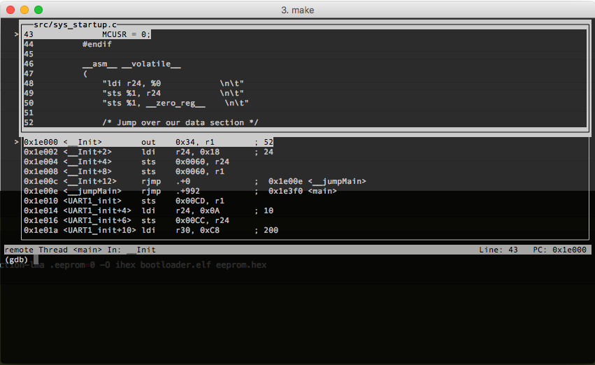

# Embedded CTF Example Code

This repository contains an example reference system for MITRE's 2017 
[Embedded System CTF](http://mitrecyberacademy.org/competitions/embedded/).
This example meets all the requirements outlined in the challenge writeup
document, but is not implemented securely.  

## Disclaimer
This code is incomplete, insecure, and does not meet MITRE standards for
quality.  This code is being provided for educational purposes to serve as a
simple example that meets the minimum functional requirements for the 2017 MITRE
eCTF competition.  Use this code at your own risk!

# Getting Started
Before you can work on your bootloader, you'll first need to get up and running
with our common development environment. All eCTF development and testing will
happen in a vagrant provisioned virtual machine.

## Prerequisites
Note: if you already have one of these dependencies installed you should not
need to install it again.

1. Download and install VirtualBox here:
   [https://www.virtualbox.org/wiki/Downloads] using the provided instructions.
2. Download and install VirtualBox Extensions (for USB support) from the same
   link: [https://www.virtualbox.org/wiki/Downloads] using the provided
   instructions.
3. Download and install Vagrant here:
   [https://www.vagrantup.com/downloads.html] using the provided instructions.
4. Download and install git here:
   [https://git-scm.com/download] using the provided instructions.

## Downloading the Build Environment
Clone this repo using git by running the following command in your preferred
shell:


```
git clone https://github.com/mitre-cyber-academy/2017-ectf-insecure-example.git
```

This will download the latest version of the build environment and example
source code into the current directory.

## Getting the VM Up and Running
Once you have downloaded the build environment, change into its direcotry in 
your shell and follow these steps to start up your VM:

1. Copy `Vagrantfile.local.example` to `Vagrantfile.local`.
2. Open `Vagrantfile.local` and ensure that the configurations make sense for
   your system configuration.
3. Run `vagrant up` in the shell/command line of your choice to download the VM
   image, provision your VM, and start it up.
4. Run `vagrant ssh` to log in to the VM.

If any errors occur during steps 3 or 4, try to resolve them by modifying
`Vagrantfile.local` rather than `Vagrantfile`.

The AVR Dragon and USB to RS232 converters should be automatically handed over
to the VM when it is running, but if they are not you should be able to attach
them through the virtualbox GUI. If you run into problems with USB that you
cannot resolve on your own, please ask for help in the eCTF Slack channel.

## Connecting the Boards
To connect the AVR Dragon to the Protostack board, use the included ribbon cable
to connect the 6-pin ISP header on the AVR Dragon to the ISP10 header on the
protostack board.  The notch on the connecting cable should face towards pin-1
on the Dragon. Do not use the 10-pin connector on the Dragon -- this is for JTAG
and is not needed to get up and running.

# Provided Files
1. `Vagrantfile`
The base configurations for vagrant. You are not allowed to modify this file.

2. `Vagrantfile.local` (and `Vagrantfile.local.example`)
Local configurations for the VM on _your computer only_. An example is provided
with basic configurations for reference. You should not submit this file, as we
have our own configurations.

3. `Vagrantfile.team`
Configurations for your team's submission. This is where you add tools,
dependencies, and configurations that are required for your submission. Please
add only required dependencies and configurations (editors, IDEs, etc go in
Vagrantfile.local).

4. `bootloader/`
In this directory is the example bootloader we have provided to you for
reference. When you submit your code, your bootloader should be in this
directory. See `bootloader/README.md` for bootloader-specific instructions and
help.

5. `host_tools/`
In this directory are the example host tools we have provided to you for
reference. When you submit your code, your host tools should be in this
directory. See `host_tools/README.md` for host-tool-specific instructions and
help.

# Host Tools
The host tools are intended to be run from your VM. They communicate with the
bootloader over UART1 on the AVR.

## How to Run the Tools
All of the example host tools are written in python, but do not have .py file
extensions. In Linux (e.g., on your vagrant VM) you should be able to run them
as a regular program/script (i.e., `./bl_build`). If that isn't working you may
need to run them an argument to the python interpreter (i.e.,
`python bl_build`). The result will be the same either way.

All tools that take arguments should have a help flag (`-h`) that will provide
descriptions.

## Checking Code Size 
To check the size of your bootloader code you can run:
`avr-size flash.hex`

Also, the file `bootloader.map` is now created when the firmware is created. It provides a description on where functions are located in program memory. 

## Programming the Board
The following command should program your board with the output from your
`bl_build` tool:

```
avrdude -P usb -p m1284p -c dragon_isp -B 200 -u -U flash:w:flash.hex:i \
                                                 -U eeprom:w:eeprom.hex:i \
                                                 -U lfuse:w:lfuse.hex:i \
                                                 -U hfuse:w:hfuse.hex:i \
                                                 -U efuse:w:efuse.hex:i
```

Refer to the
[avrdude documentation](http://www.nongnu.org/avrdude/user-manual/avrdude.html)
for additional help with avrdude.

The AVR dragon may occasionally end up in a state where it no longer responds to
avrdude. If this happens, the problem can be resolved by disconnecting and
reconnecting the dragon's USB cable.

## Makefile, Flashing and Debugging

The Makefile contains targets for both flashing and debugging the AVR as well as using the JTAG 
functionality of the Dragon. There is a number of caveats to getting this to
work. The first is that JTAG must be connected by jumpers since neither the 10-pin or 6-pin
ISP connectors on the protostack board.

Refer to the JTAG connector pinout on the Dragon Board 
[here](http://www.atmel.com/webdoc/avrdragon/avrdragon.using_ocd_physical_jtag.html) in Figure 27.

The JTAG pins connect to the AVR as follows:

| JTAG PIN  | AVR PIN  |
|:--------- |:-------- |
| TDI       | PC5      | 
| TDO       | PC4      |
| TMS       | PC3      |
| TCK       | PC2      |

NOTE: The VCC, Reset and Ground lines from the dragon must also be connected. If the 6-pin header of your 
protostack board is unpopulated, these pins are exposed on the 10-pin ISP connector. The pinout for the
10-pin ISP connector can be found [here](http://www.sunrom.com/learn/avr-isp-10-pin-for-programming)

In order to start a debug session, simply have the dragon propely connected over JTAG, then flash your 
bootloader image calling avrdude from the command line or using `make flash`. Once the bootloader has been
successfully loaded you can either run `make debug` which should open an instance of avarice by calling
`avarice -R -g :4242`  which connects  to the microcontroller, then starts/configures an instance of 
avr-gdb with the elf file full of debug symbols. 

The `avarice` and `avr-gdb` tools are now included in the `Vagrant.team` files. If you setup your VM previously,
you can run `sudo apt-get install avarice` and `sudo apt-get install gdb-avr`. Alternatively, you can run 
`vagrant up --provision	` to re-provision the VM with the new configuration.

NOTE: The specific configuration of avr-gdb is handled behind the scenes in the `.gdbinit` file.  

IMPORTANT NOTE: Debugging will ONLY work if your dragon has the latest firmware version (reported by avrdude to be 7.39) You can run `avrdude -P usb -p m1284p -c dragon_jtag -vv` to get something that looks similar to 
the following report. YOU want the `firmware_version` for the `M_MCU` and `S_MCU` to both be 7.39 as shown 
bellow. IF your dragon does not have the latest FW version you must install ATMEL Studio, connect your dragon
and protostack using the programming tools menu. From there once you read from the AVR the first time ATMEL 
studio will prompt you to update your dragon to firmware 7.xx. Update then run avrdude again to make sure
you have the proper firmware version.

```
avrdude: Version 6.0.1, compiled on Dec 16 2013 at 17:26:24
   Copyright (c) 2000-2005 Brian Dean, http://www.bdmicro.com/
   Copyright (c) 2007-2009 Joerg Wunsch

   System wide configuration file is "/usr/local/CrossPack-AVR-20131216/etc/avrdude.conf"
   User configuration file is "/Users/hgiannopoulos/.avrduderc"
   User configuration file does not exist or is not a regular file, skipping

   Using Port                    : usb
   Using Programmer              : dragon_jtag
   avrdude: jtagmkII_dragon_open()
   avrdude: usbdev_open(): Found AVRDRAGON, serno: 00A20006485C
   avrdude: jtagmkII_getsync(): Sending sign-on command: 0x86 (26 bytes msg)
   JTAG ICE mkII sign-on message:
   Communications protocol version: 1
   M_MCU:
      boot-loader FW version:        255
      firmware version:              7.39
      hardware version:              1
   S_MCU:
      boot-loader FW version:        255
      firmware version:              7.39
      hardware version:              7
   Serial number:                   00:a2:00:06:48:5c
   Device ID:                       AVRDRAGON
```

Once you run `make debug` you should get a window that looks like this:



## Tool Specifications
Detailed tool specifications should be found in the challenge rules document.

Note that while you may completely rewrite the tools, they should still live in
this directory.

Your tools must be written to the exact specifications in the rules with no
additional required arguments or other user inputs. This allows us to write
automated tests to check if your submission is complete. If you have questions
about the specifications please contact the organizers in Slack or by email:
ectf@mitre.org.
